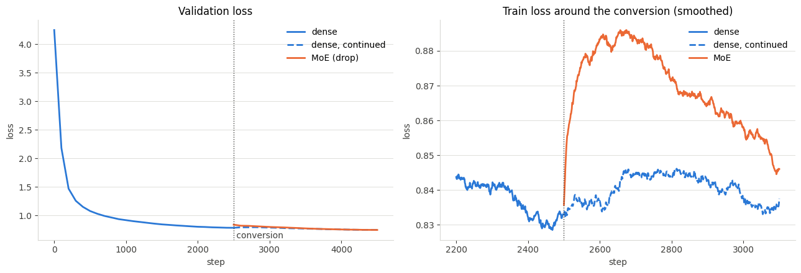
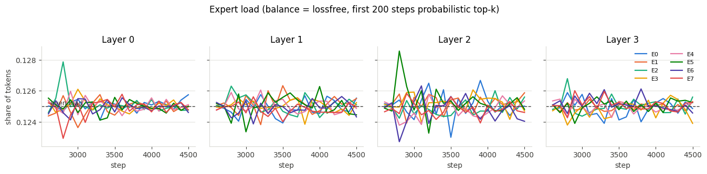
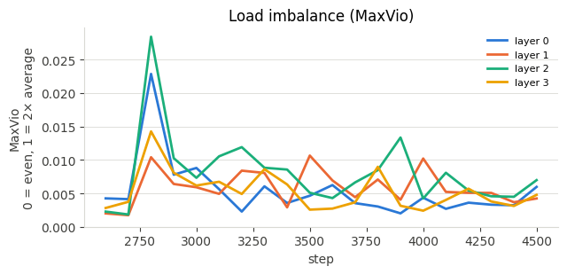
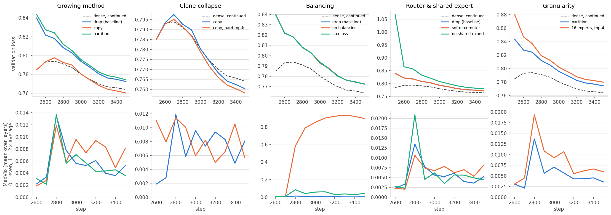

# Growing a dense model into a Mixture-of-Experts

A small dense ("linear") GPT is trained, then converted into a Mixture-of-Experts (MoE) model and trained further. The aim is to show that the MoE keeps training after conversion and its loss keeps falling.

Section numbers (§) refer to the course notes on Mixture-of-Experts that this work follows.

**Result:** the MoE kept training after conversion and ended **0.037 below** the validation loss it started from (0.7848 → 0.7476). Within 2,000 steps it recovered the whole conversion cost and drew level with a dense model trained for the same steps (0.7476 vs 0.7473).

---

## Files

| File | What it is |
|---|---|
| `moe_upcycling_run.ipynb` | The executed Colab notebook (T4 GPU), with every output and chart |
| `moe_upcycling.ipynb` | The same notebook without outputs, ready to re-run |
| `experiments.csv`, `experiments.png` | Results of the nine comparison experiments (section 11 of the notebook) |
| `main_loss.png`, `main_expert_load.png`, `main_maxvio.png` | Charts from the main run |
| `dense.pt`, `moe.pt` | Checkpoints: the dense model at conversion, and the final MoE |
| `tinystories_valid.txt` | The training text. Not stored in the repo; the notebook downloads it automatically |

To reproduce: open `moe_upcycling.ipynb` in Colab, set the runtime to T4 GPU, then Run all. Sections 1–10 take about 15 minutes and section 11 about 30.

---

## Setup

**Data.** `TinyStoriesV2-GPT4-valid.txt` (22.2M characters), modelled at the character level (vocabulary of 67), split 90/10 into train and validation. The dense stage sees the training text about once.

**Dense ("linear") model.** A small GPT: 4 layers, hidden size 256, 4 attention heads, context 128. Its feed-forward block is a SwiGLU network with inner width 768. **3.48M parameters.** Trained for 2,500 steps (batch 64, peak learning rate 1e-3, cosine schedule).

**The MoE.** Every layer's feed-forward block is replaced by:

| Part | Choice | Course |
|---|---|---|
| Shared expert | Always on; the first half (384) of the dense network's neurons | §8 |
| Routed experts | 8 per layer, each 384 wide, built from the other half by **drop-upcycling** (r = 0.5): a copy with half its neurons redrawn, and the redrawn neurons' output weights set to zero | §15 |
| Router | Sigmoid scores; top-2 rescaled to sum to 1; fp32; initialised at 1/10 the usual scale | §7 |
| Early routing | **Probabilistic top-k** for the first 200 steps, then hard top-k | §15 |
| Balancing | **Auxiliary-loss-free bias** (γ = 0.001), used only for choosing, plus a 0.0001 sequence-level loss; load counted over the whole batch | §13, §14, §20 |
| Capacity | **Dropless**: no token is ever dropped | §11 |

**11.75M total parameters, 4.67M active per token**: 3.4× the dense model's size for 1.3× its compute per token.

After conversion, the MoE and a copy of the dense model each train for 2,000 more steps (peak learning rate 3e-4, 100-step warmup), measured on the same fixed validation batches.

---

## How the router works, and how to tell every expert is used

**The router** is a small linear layer in each MoE layer. For every token it does two jobs:

1. **Chooses which experts.** It gives each of the 8 routed experts a score between 0 and 1 (sigmoid), adds a per-expert balancing bias, and keeps the 2 highest.
2. **Decides how much each counts.** The two chosen experts' *raw* scores, without the bias, are rescaled to sum to 1 and used as weights on their outputs.

The layer's output is: shared expert + w₁ · expert₁ + w₂ · expert₂.

**The balancing bias** stops the router from favouring a few experts. Left alone, an expert chosen slightly more often gets more training, gets better, and gets chosen even more, until other experts stop learning (§10). After every training step, each busy expert's bias is lowered by 0.001 and each quiet expert's is raised by 0.001. The bias only affects *which* experts are picked. It never changes the output weights or the loss, so it doesn't compete with the language-modelling objective (§13).

**Five measurements show whether every expert is used.** Each is computed per layer from the share of routing decisions each expert receives.

| Metric | What it means | Perfectly even | During training (each reading averages 100 steps) | Final model on validation data |
|---|---|---|---|---|
| **Share of routing per expert** | Fraction of routing decisions each expert receives | 1 ÷ 8 = 12.5% (each token makes 2 decisions, so each expert sees 25% of tokens) | 12.3% – 12.9% | 11.3% – 13.8% |
| **MaxVio** | (busiest expert's load − average) ÷ average. Catches the single worst expert, which is what slows a GPU under expert parallelism | 0 (1 = busiest gets twice the average) | about 0.01 | 0.04 – 0.10 |
| **Coefficient of variation (CV)** | Standard deviation of the loads ÷ their mean. Summarises the spread across *all* experts | 0 | — | 0.03 – 0.06 |
| **Effective number of experts** | e^(entropy of the load shares): "routing behaves as if this many experts are in use" | 8 | — | **7.99 of 8** in every layer (7.985 – 7.997) |
| **Dead experts** | Experts receiving less than 10% of an even share | 0 | 0 of 32 | 0 of 32 |

The validation figures come from loading `moe.pt` (which reproduces the final validation loss of 0.7476) and counting routing over the same 20 fixed validation batches (164k tokens). They are a little less even than the training figures because they count fewer tokens: each training reading averages 100 steps, about 820k tokens. The notebook now reports CV and effective experts for every run.

As a check that the balance comes from the bias, the same model was run with balancing switched off. MaxVio climbed to about 0.9 and up to 2 experts died (see the Balancing experiment below).

---

## Main result

| Point | Validation loss |
|---|---|
| Dense model at conversion (step 2,500) | 0.7848 |
| MoE immediately after conversion | 0.8397 (**+0.055**) |
| MoE after 2,000 more steps | **0.7476** |
| Dense model after the same 2,000 steps | 0.7473 |

1. **Training continues, and loss drops.** The MoE's validation loss falls steadily from 0.8397 to 0.7476, ending 0.037 below the dense model's loss at the point of conversion.
2. **The conversion costs a small, temporary bump.** Drop-upcycling throws away half of each routed expert's original neurons so that the experts start out different. That costs +0.055 at conversion, fully recovered by the end.
3. **The train loss rises before it falls, and that's expected.** In the zoomed chart, the MoE's training loss keeps climbing for about 170 steps and peaks around step 2,680. The switch from probabilistic to hard top-k happens at step 2,700. While routing is sampled, some tokens go to an expert that isn't their best match: the model pays some loss so that every expert receives gradient. Once routing becomes hard top-k, the loss falls. The learning-rate warmup on restarting adds a smaller bump, which the dense control shows too.
4. **The experts stay balanced.** Every expert in every layer received between about 12.3% and 12.9% of the routing decisions (an even share is 12.5%). MaxVio stayed near 0.01 throughout, and no expert died.

Sample from the final MoE:

> One day, Maggie and Sam were playing in the park. The button was hot and surprised. A girl saw the bus and said, "It can play with it again."

---

## Experiments

Nine variants, each converted from the **same trained dense model** and trained for **1,000 steps on the same batches**. The control is the dense model continued for the same 1,000 steps (final validation loss **0.7641**). "vs dense" is the final loss minus the control's; negative means better.

| Variant | Total / active (M) | Jump at conversion | Final val loss | vs dense | MaxVio final (peak) | Dead experts final (peak) |
|---|---|---|---|---|---|---|
| drop (baseline) | 11.75 / 4.67 | +0.055 | 0.7725 | +0.0085 | 0.01 (0.01) | 0 / 32 (0) |
| copy | 11.75 / 4.67 | 0.000 | 0.7604 | −0.0037 | 0.01 (0.01) | 0 / 32 (0) |
| partition | 7.03 / 3.49 | +0.059 | 0.7744 | +0.0104 | 0.00 (0.01) | 0 / 32 (0) |
| copy, hard top-k from step 0 | 11.75 / 4.67 | 0.000 | 0.7583 | −0.0058 | 0.01 (0.01) | 0 / 32 (0) |
| no balancing | 11.75 / 4.67 | +0.055 | 0.7727 | +0.0086 | **0.90 (0.93)** | **1 / 32 (2)** |
| auxiliary loss | 11.75 / 4.67 | +0.055 | 0.7725 | +0.0085 | 0.04 (0.08) | 0 / 32 (0) |
| softmax router | 11.75 / 4.67 | +0.055 | 0.7722 | +0.0081 | 0.01 (0.01) | 0 / 32 (0) |
| no shared expert | 20.01 / 5.85 | **+0.283** | 0.7803 | +0.0163 | 0.00 (0.02) | 0 / 32 (0) |
| 16 experts, top-4 (partition) | 7.04 / 3.50 | +0.095 | 0.7799 | +0.0158 | 0.01 (0.02) | 0 / 64 (0) |

### Findings

**Balancing (§10, §12, §13): the clearest result.** Without balancing, MaxVio climbed to about 0.9 (the busiest expert received nearly twice the average load), and up to 2 experts died. The auxiliary loss held MaxVio at 0.04–0.08, and the loss-free bias at about 0.01, 4–8× tighter than the auxiliary loss. Validation loss was the same in all three runs (0.7725–0.7727), so at this scale imbalance doesn't yet cost quality. Its cost would appear as uneven GPU load under expert parallelism (§10, §16). One detail: without balancing, MaxVio stayed near 0 until step 2,700 and then jumped. That is exactly when probabilistic top-k ended, so the sampled routing had been hiding the imbalance.

**Shared expert (§8): clearly helps.** Without a shared expert, every expert is a full-width copy with half its neurons redrawn, so the conversion jump was 5× bigger (+0.283 vs +0.055). That run also finished worst (0.7803), even though it uses *more* active parameters (5.85M vs 4.67M). This matches DeepSeekMoE's result in §8, where removing the shared expert raised the loss.

**Growing method (§15).** Plain copying had no jump and finished slightly *ahead* of the dense control (−0.004). Drop-upcycling and partition paid +0.055 and +0.059 at conversion and were still about 0.01 behind the control after 1,000 steps, though in the 2,000-step main run drop-upcycling fully caught up. At this small size, plain copying wins, which matches the Amazon expert-upcycling study cited in §15. The point of making the experts different is expected to matter more with many experts and longer training.

**Clone collapse (§15): did not reproduce.** Exact copies with hard top-k from step 0 had no dead experts and the best final loss (0.7583). The collapse in §15 happened with 460 experts in families of 23 near-identical clones. Here there are only 8 experts, and the bias balancing already pushes tokens to every expert, so the clones separate on their own. At this scale, probabilistic top-k is a safeguard rather than a necessity.

**Softmax vs sigmoid (§7): no difference** (0.7722 vs 0.7725, same MaxVio). With the loss-free bias doing the balancing, the score function made no measurable difference here.

**Granularity (§8).** At the same active size (3.5M), 16 experts with top-4 did worse than 8 experts with top-2 (0.7799 vs 0.7744) and had a larger jump (+0.095 vs +0.059). Quarter-width experts each keep less of the dense network when it is cut up. The advantage of finer experts reported in §8 comes from training at far larger scale than 1,000 steps on a 3.5M-parameter model.

### Limits

- Each variant ran once with one seed, so final-loss differences under about 0.005 (copy vs hard top-k, softmax vs sigmoid, drop vs auxiliary loss) are within noise. The balancing and shared-expert results are well beyond that.
- The experiments ran for 1,000 steps; the main run for 2,000. Variants with a larger conversion jump hadn't finished recovering.
- The model is tiny (3.5M dense parameters) and character-level, so these results describe the mechanics of conversion, not how a large MoE would behave.

---

## Next steps

Each step follows from something seen in these results.

| Next step | Why | Feasible on a free Colab T4? |
|---|---|---|
| **Repeat each experiment with 3 seeds** and report mean ± spread | Many differences between variants were under 0.005, which is within single-run noise. Repeats would show which results are real. | Yes. Triples the run time (about 1.5 hours for all 9 variants) |
| **64 experts instead of 8** | Clone collapse didn't appear with 8 experts. The course observed it with 460. Testing 64 cloned experts with hard vs probabilistic top-k would show whether it appears as the expert count grows. | Yes, at the current model size, though slower per step |
| **Sweep the redraw fraction r** (0 to 0.75) | Plain copying beat drop-upcycling (r = 0.5) here, while the course reports r = 0.5 as best at large scale. A sweep would show where redrawing starts to pay off. | Yes |
| **Train longer** | Drop-upcycling was 0.009 behind dense after 1,000 steps and level after 2,000. Longer training would show whether the MoE moves ahead or stays level. | Yes |
| **Scale up 10–100×** | The MoE only matched the dense model here. Its advantage, more capacity for little extra compute per token, should appear once capacity becomes the limit. | 10× is borderline (a few hours per run); 100× needs larger GPUs |

### Repeating runs with several seeds

A single run can't separate a real difference from luck: a different random seed changes the starting router weights, which neurons get redrawn, and the order of training batches. The plan:

- Run every variant with **3 seeds** (for example 0, 1 and 2), keeping everything else identical.
- Report each result as **mean ± standard deviation** across the 3 runs.
- Treat a difference between two variants as real only if it is **larger than about twice the spread** of either one. Otherwise, report the two as level.

Expected effect: the balancing result (MaxVio 0.01 vs 0.9) and the shared-expert result (+0.28 vs +0.055 jump) should survive easily. Differences under 0.005, such as softmax vs sigmoid or copy vs hard top-k, will probably turn out to be ties.

### Scaling up

Rough estimates, so treat them as orders of magnitude. Training compute ≈ 6 × active parameters × training tokens (course notes §1). Tokens are set at about 20 per dense parameter, the usual compute-optimal rule of thumb for dense models. GPU speed assumes 25–40% of peak: T4 ≈ 16 TFLOPS achieved, A100 ≈ 125, 8 × H100 ≈ 3,200. The 10× and 100× rows assume a 32,000-token BPE vocabulary rather than characters, so their embeddings are much larger.

| Step | Dense model | MoE (8 experts, top-2): total / active | Training tokens | T4 | 1 × A100 | 8 × H100 |
|---|---|---|---|---|---|---|
| **This run** | 4 layers, width 256: 3.5M | 11.75M / 4.67M | ~0.04B characters | ~15 min | — | — |
| **~10×** | 8 layers, width 512: ~60M | ~126M / ~70M | ~1.2B | ~9 hours | ~1 hour | minutes |
| **~100×** | 16 layers, width 1280: ~420M | ~1.25B / ~540M | ~8.5B | ~20 days | ~2.5 days | ~2.5 hours |
| **Course reference model** (Qwen3-30B-A3B shape) | 48 layers, width 2048 | 30.5B / 3.3B | trillions | — | — | needs a B200 node with expert parallelism (EP = 8) (§19) |

The 10× step is the largest that fits a single Colab GPU, and a free T4 session would likely disconnect before it finishes. From 100× upward, the work needs a multi-GPU node.

### How many experts?

A more diverse corpus (web text, books, maths, code) does **not** mean one expert per subject. Experts mostly specialise by kind of token (punctuation, verbs, numbers, names, code syntax) rather than by subject (§9). Models that all train on the same broad mix use very different expert counts:

| Model | Routed experts | Used per token | Total / active |
|---|---|---|---|
| Mixtral 8x7B | 8 | 2 | 47B / 13B |
| Qwen3-30B-A3B (course reference) | 128 | 8 | 30.5B / 3.3B |
| DeepSeek-V3 | 256 + 1 shared | 8 | 671B / 37B |
| Kimi K2 | 384 + 1 shared | 8 | 1.04T / 32.6B |

The count is set by budget and settled by experiment, in three steps:

1. **Compute budget → top-k × expert width (arithmetic).** A token's cost depends on top-k times the expert width, plus the shared expert. Top-2 of 768-wide experts, top-4 of 384-wide and top-8 of 192-wide all cost the same. Top-k is how the active budget is divided, not a separate decision.
2. **Memory → maximum number of experts (arithmetic).** Every expert is stored and trained (about 16 bytes per weight in mixed precision, §1), so GPU memory caps the total parameters and therefore the expert count.
3. **Short runs → the actual number (experiment).** Within those limits, train a few layouts at the **same active size** (for example 16, 32 and 64 experts with matching top-k and width) and compare loss and balance (§20). Kimi K2 chose 48 experts per active expert this way. The granularity experiment above (8 experts top-2 vs 16 experts top-4) is a small version of this test.

What diverse data *does* change: it gives extra capacity something to store, which makes more experts worthwhile. Balancing over the whole batch rather than small chunks lets subject-leaning experts form where they help (§14). A shared expert gives common knowledge, such as grammar and frequent words, one place to live (§8). When growing the expert count later, top-k usually rises too: the course's Lightning LM went from top-2 to top-12 when growing from 20 to 460 experts (§15).

Starting points to test for the scale-up steps above:

| Step | Layout to start from |
|---|---|
| ~10× (~60M dense) | 8–16 experts, top-2, 1 shared |
| ~100× (~420M dense) | 32–64 smaller experts, top-4 to top-8, 1 shared |
| Course reference size (~30B) | 128 experts top-8, or 256 + 1 shared top-8 |

### From this experiment to a realistic LLM

This notebook shows the mechanics of converting a dense model into an MoE. Turning that into a usable language model needs the following changes, roughly in order:

1. **A real tokenizer.** Replace characters with a BPE tokenizer (around 32,000–150,000 tokens), so the model predicts words and word pieces, not letters.
2. **Much more and better data.** Billions to trillions of tokens of cleaned, deduplicated text (for example web text such as FineWeb-Edu, plus code and maths), instead of 22M characters of children's stories.
3. **Grow in stages, as the course's Lightning LM did (§15).** Train a dense model first to get good embeddings. Convert it to an MoE with a few experts (for example 20 routed + 1 shared, by partition). Later, clone up to many experts, using probabilistic top-k early on so near-identical clones don't collapse.
4. **Efficient expert computation.** This notebook runs the experts one at a time in a Python loop, which is fine for 8 experts but far too slow at scale. Real training uses grouped or block-sparse matrix multiplication (MegaBlocks-style, §11), still dropless.
5. **Multi-GPU layout (§16–§19).** Expert parallelism inside one node (EP = 8), ZeRO-1 for the dense parts, bf16 mixed precision with the router kept in fp32, and activation recomputation if memory is tight.
6. **Balancing at scale.** Keep the loss-free bias (γ around 0.001) with a tiny sequence-level loss, count load across the whole batch (§14), and monitor MaxVio and dead experts per layer throughout training.
7. **Evaluation beyond validation loss.** Track downstream benchmarks (for example MMLU and GSM8K) and look at what each expert learns (§9).
8. **After pre-training.** Instruction fine-tuning and reinforcement learning, with the router frozen during reinforcement learning, as MiMo-V2.6 did after measuring router collapse (§10).

---

## What went wrong first

The first run used TinyShakespeare (1.1M characters). By the conversion point the model had seen that text about 20 times, so it was memorising it. After conversion, validation loss *rose* for both the dense model (+0.014) and the MoE (+0.018), so the run couldn't show the loss falling. Switching to TinyStories (20× more text, about 1 pass in the dense stage) fixed it.
